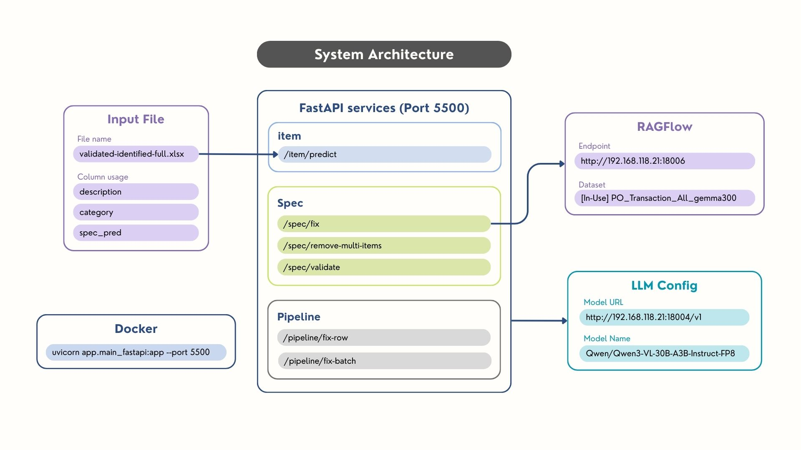
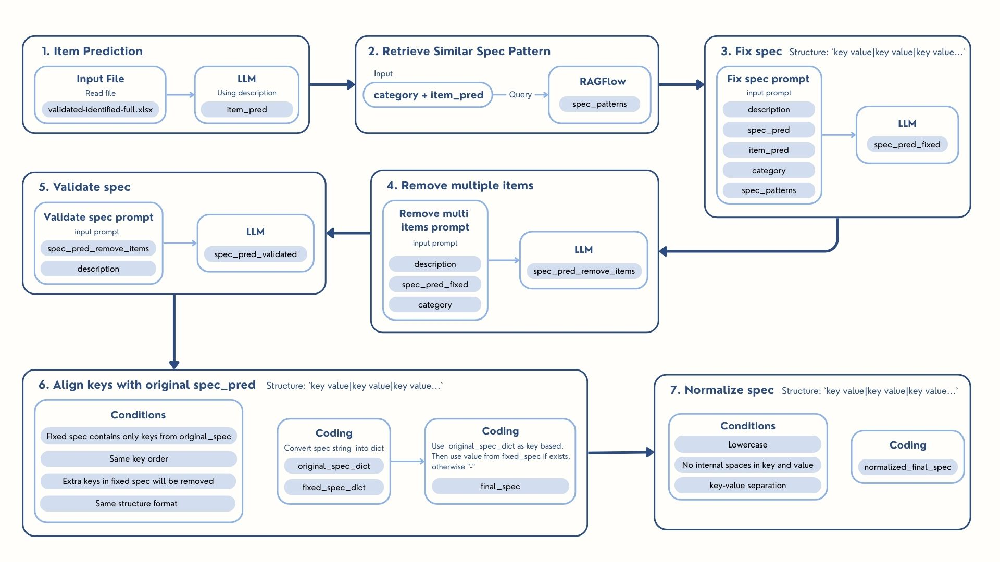

# PTVN Data Validator

## Data Validation Services
Automated Item Prediction · RAG Category Fixing · Specification Validation · Multi-Item Detection · FastAPI Microservices

This project provides an intelligent data validation and fixing system that leverages Large Language Models (LLMs) and Retrieval-Augmented Generation (RAG) to automatically validate, fix, and enhance product catalog data.

## How to Use

### 1. Run FastAPI Local Server
Start the server locally using uvicorn:
```bash
uvicorn app.fastapi.main:app --port 5500 --reload
```

### 2. Run Batch Processing Script (`run_fastapi.py`)
To test the batch processing API programmatically, use the included Python script. Make sure the FastAPI server is running first.
```bash
python run_fastapi.py
```
This script will:
- Load test data from `demo_dataset/demo.csv`
- Process rows in batches of 50 against the `POST /pipeline/fix-batch` endpoint
- Save the processed results to `output/output_demo.csv`

### 3. API Endpoints
The system provides two main endpoints to run the data validation and fixing program via HTTP requests.

#### Batch Processing Endpoint
- **URL**: `POST /pipeline/fix-batch`
- **Description**: Processes multiple rows of data concurrently.

**Input Parameter Format:**
```json
{
  "rows": [
    {
      "description": "string",
      "spec_pred": "string",
      "category": "string"
    }
  ],
  "post_process": true
}
```

#### Single Row Processing Endpoint
- **URL**: `POST /pipeline/fix-row`
- **Description**: Processes a single row of data.

**Input Parameter Format:**
```json
{
  "description": "string",
  "spec_pred": "string",
  "category": "string",
  "post_process": true
}
```

### post_process Parameter Details
- **`post_process`** (*boolean*, default: `true`): 
  - If `true`: Returns a simplified response containing only the final `description`, `category`, and `spec_pred`. Useful when you only need the final corrected data.
  - If `false`: Returns the full detailed response including intermediate fields like `item_pred`, `item_extracted`, and boolean flags showing what was changed (`spec_changed`, `category_changed`).

### Other Endpoints
- **Validation & Fixing**: `POST /item/predict`, `POST /category/fix`, `POST /spec/fix`
- **Health Monitoring**: `GET /health`

## System Overview



The system processes product descriptions and specifications to:
1. **Predict items** from product descriptions using LLM
2. **Fix categories** based on RAG-retrieved patterns
3. **Validate and correct specifications** using multi-stage LLM pipelines
4. **Extract structured data** from unstructured text
5. **Remove duplicate items** from specifications
6. **Ensure data quality** through automated validation

### Core Components
- **FastAPI Server**: REST API endpoints for data processing
- **Fixer Service**: Orchestrates the data fixing workflow
- **LLM Service**: Handles LLM interactions for prediction and validation
- **RagFlow Service**: Retrieves similar patterns from knowledge base
- **Pipeline**: Batch processing with async concurrency control

## Project Structure
```text
data_validation/
├── app/
│   ├── fastapi/          # FastAPI application
│   │   ├── api/          # API routes, deps, models, and state
│   │   │   ├── routers/
│   │   │   │   ├── category.py
│   │   │   │   ├── health.py
│   │   │   │   ├── item.py
│   │   │   │   ├── pipeline.py
│   │   │   │   └── spec.py
│   │   │   ├── deps.py
│   │   │   ├── models.py
│   │   │   └── state.py
│   │   └── main.py       # FastAPI app configuration
│   ├── pipeline/         # Batch processing pipeline
│   │   ├── pipeline.py
│   │   └── run_pipeline.py
│   ├── prompts/          # LLM prompt templates
│   │   ├── fix_category.txt        # Prompt to fix category
│   │   ├── fix_spec.txt            # Prompt to fix specification
│   │   ├── predict_item.txt        # Prompt to predict item from description
│   │   ├── remove_multi_items.txt  # Prompt to remove duplicate item keys
│   │   └── validate_spec.txt       # Prompt to validate final specification
│   ├── services/         # Core services
│   │   ├── fixer_service.py    # Main fixing workflow
│   │   ├── llm_service.py      # LLM interactions
│   │   └── ragflow_service.py  # RAG operations
│   └── utils/            # Utility functions
│       ├── config.py
│       ├── spec_models.py
│       └── spec_parser.py
├── demo_dataset/         # Sample datasets
│   └── demo.csv
├── output/               # Output directory
├── system_architecture_image/
│   ├── system_architecture.jpg
│   └── workflow_no_fix_category.jpg
├── Dockerfile            # Container configuration
├── docker-compose.yml    # Docker Compose setup
├── README.md             # Project documentation
├── requirements.txt      # Python dependencies
└── run_fastapi.py        # Example batch processing script
```

## Workflow: Data Fixing Pipeline
Pipeline Order
1. **Item Prediction**: Predict item name from description using LLM
2. **RAG Query**: Retrieve similar patterns from RagFlow using predicted item
3. **Category Fix**: Fix category using RAG-retrieved categories
4. **Spec Fix**: Fix specifications using description and patterns
5. **Multi-Item Removal**: Remove duplicate items from specifications
6. **Spec Validation**: Final validation of specifications against description
7. **Item Extraction**: Extract final item from validated specifications

## Configuration Settings
When running the data validator, you can configure the following parameters in your `.env` file:

### 1. LLM Parameter
- **`MODEL_NAME`**: Configure the Qwen3-VL-30B model.

### 2. RAG Settings
- **`TOP_K`**: Number of similar patterns to retrieve: `30`
- **`RAGFLOW_SIMILARITY_THRESHOLD`**: Minimum similarity score: `0.2`
- **`RAGFLOW_VECTOR_SIMILARITY_WEIGHT`**: Weight for vector similarity: `0.3`

#### Key Behavior:
- Automatic item prediction from descriptions
- Category correction using domain knowledge
- Specification validation and fixing
- Multi-item detection and removal
- Async batch processing with configurable concurrency
- Timeout safeguards for LLM calls

### API Documentation
Once the server is running, visit:
- **Swagger UI**: http://localhost:5500/docs
- **ReDoc**: http://localhost:5500/redoc

## Prompt Logic
The fixing logic uses LLM prompts located in `app/prompts/` to perform its tasks:
- **Item Prediction**: Extracts the core product name
- **Category Fixing**: Determines the correct category from RAG suggestions
- **Specification Validation**: Verifies and corrects specs against the description
- **Multi-Item Removal**: Detects and cleans up mixed item specifications


